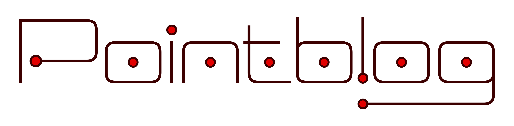

 Order By Default Date - Oldest Date - Newest Title Author

| Date | Title | Author |
|----|----|----|
| Jun 4, 2025 | [Data Validation Libraries for Polars (2025 Edition)](validation-libs-2025/index.md) | Rich Iannone |
| Jun 3, 2025 | [C'mon C'mon: Let's Do a Pointblank Workshop!](lets-workshop-together/index.md) | Rich Iannone |
| May 20, 2025 | [Overhauling Pointblank's User Guide](overhauled-user-guide/index.md) | Rich Iannone and Michael Chow |
| May 2, 2025 | <a href="../blog/all-about-actions/index.html" class="title listing-title">Level Up Your Data Validation with <code>Actions</code> and <code>FinalActions</code></a> | Rich Iannone |
| Apr 4, 2025 | [Introducing Pointblank](intro-pointblank/index.md) | Rich Iannone |

No matching items
