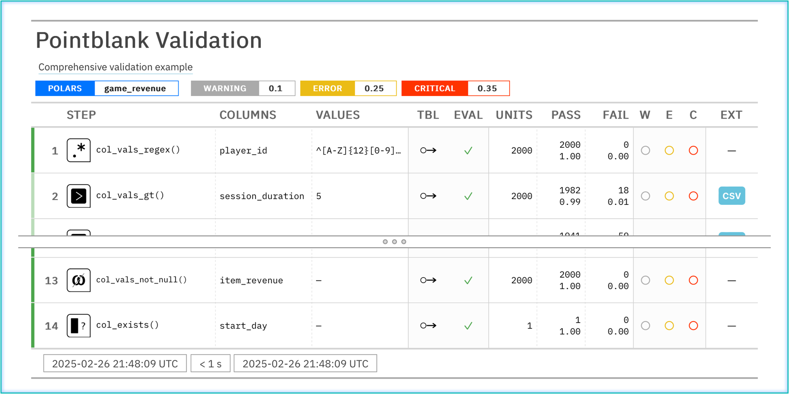
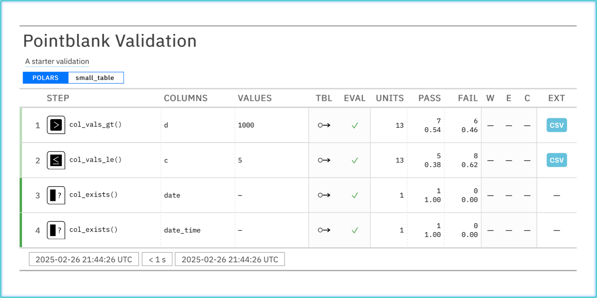
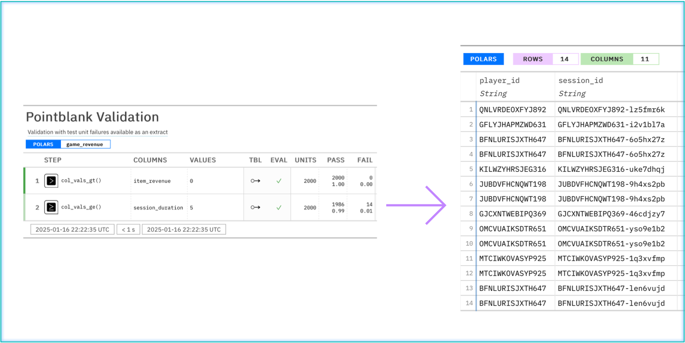
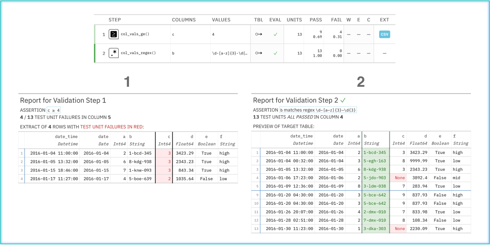
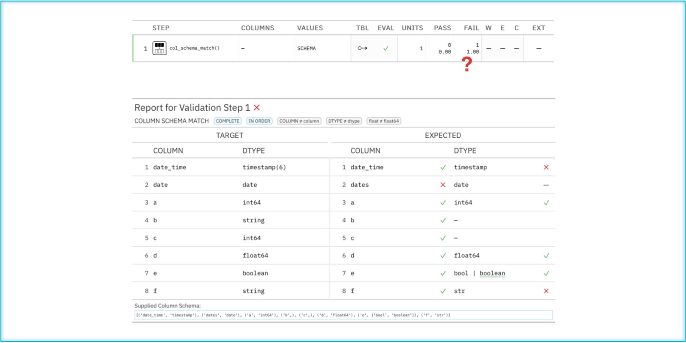
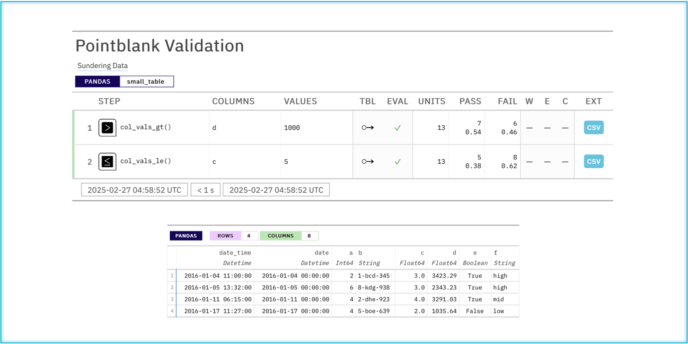
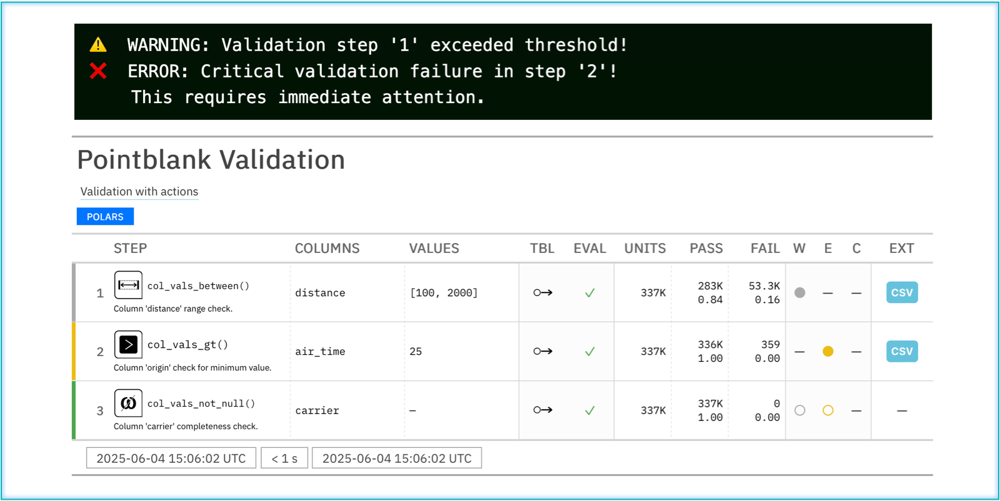
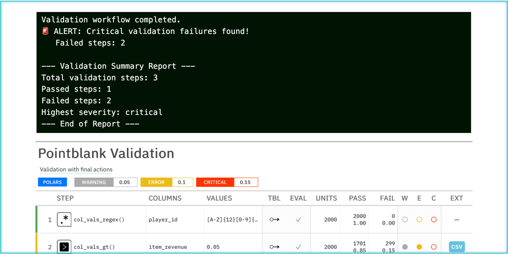

# Demos

Advanced Validation

A validation with a comprehensive set of rules.

Starter Validation

A validation with the basics.

Data Extracts

Pulling out data extracts that highlight rows with validation failures.

Step Reports for Column Data Checks

A step report for column checks shows what went wrong.

Step Report for a Schema Check

When a schema doesn't match, a step report gives you the details.

Sundered Data

Splitting your data into 'pass' and 'fail' subsets.

Step-Level Actions

Configure actions to trigger when validation thresholds are exceeded, such as logging warnings or errors.

Final Actions

Execute actions after validation completes, such as sending alerts or generating summary reports.

------------------------------------------------------------------------

Set Failure Threshold Levels

Set threshold levels to better gauge adverse data quality.

Apply Validation Rules to Multiple Columns

Create multiple validation steps by using a list of column names with columns=.

Checks for Missing Values

Perform validations that check whether missing/NA/Null values are present.

Custom Expression for Checking Column Values

A column expression can be used to check column values. Just use col_vals_expr() for this.

Comparison Checks Across Columns

Perform comparisons of values in columns to values in other columns.

Custom Validation with specially()

Create bespoke validations using specially() to implement domain-specific business rules.

Expect No Duplicate Rows

We can check for duplicate rows in the table with rows_distinct().

Checking for Duplicate Values

To check for duplicate values down a column, use rows_distinct() with a columns_subset= value.

Expectations with a Text Pattern

With col_vals_regex(), check for conformance to a regular expression.

Numeric Comparisons

Perform comparisons of values in columns to fixed values.

Set Membership

Perform validations that check whether values are part of a set (or not part of one).

Validating Data Freshness

Use date-based validations to ensure your data is current and recent.

Verifying Row and Column Counts

Check the dimensions of the table with the \*\_count_match() validation methods.

CLI Interactive Demos

These CLI demos showcase practical data quality workflows that you can use!

Column Selector Functions: Easily Pick Columns

Use column selector functions in the columns= argument to conveniently choose columns.

Date and Datetime Validations

Comprehensive examples of date, datetime, and timezone-aware datetime comparisons.

Mutate the Table in a Validation Step

For far more specialized validations, modify the table with the pre= argument before checking it.

Check the Schema of a Table

The schema of a table can be flexibly defined with Schema and verified with col_schema_match().

Using Parquet Data

A Parquet dataset can be used for data validation, thanks to Ibis.
