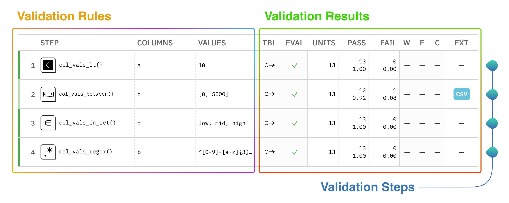
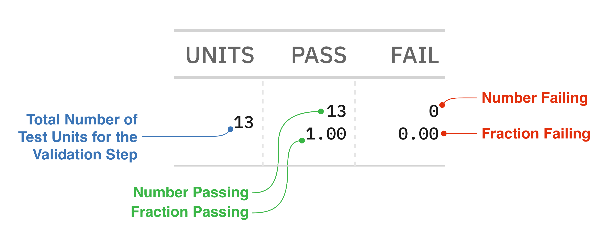

# Quickstart

The Pointblank library is all about assessing the state of data quality for a table. You provide the validation rules and the library will dutifully interrogate the data and provide useful reporting. We can use different types of tables like Polars and Pandas DataFrames, Parquet files, or various database tables. Let's walk through what data validation looks like in Pointblank.


# A Simple Validation Table

This is a validation report table that is produced from a validation of a Polars DataFrame:


Show the code

``` python
import pointblank as pb

(
    pb.Validate(data=pb.load_dataset(dataset="small_table"), label="Example Validation")
    .col_vals_lt(columns="a", value=10)
    .col_vals_between(columns="d", left=0, right=5000)
    .col_vals_in_set(columns="f", set=["low", "mid", "high"])
    .col_vals_regex(columns="b", pattern=r"^[0-9]-[a-z]{3}-[0-9]{3}$")
    .interrogate()
)
```


<table class="gt_table" style="table-layout: fixed;; width: 0px" data-quarto-disable-processing="true" data-quarto-bootstrap="false">
<thead>
<tr class="gt_heading">
<th colspan="14" class="gt_heading gt_title gt_font_normal" style="text-align: left; color: #444444; font-size: 28px; font-weight: bold;">Pointblank Validation</th>
</tr>
<tr class="gt_heading">
<th colspan="14" class="gt_heading gt_subtitle gt_font_normal gt_bottom_border" style="text-align: left;"><div>
<span style="text-decoration-style: solid; text-decoration-color: #ADD8E6; text-decoration-line: underline; text-underline-position: under; color: #333333; font-variant-numeric: tabular-nums; padding-left: 4px; margin-right: 5px; padding-right: 2px;">Example Validation</span>

<span style="background-color: #0075FF; color: #FFFFFF; padding: 0.5em 0.5em; position: inherit; text-transform: uppercase; margin: 5px 10px 5px 0px; border: solid 1px #0075FF; font-weight: bold; padding: 2px 10px 2px 10px; font-size: 10px;">Polars</span>

</div></th>
</tr>
<tr class="gt_col_headings">
<th id="pb_tbl-status_color" class="gt_col_heading gt_columns_bottom_border gt_left" style="color: #666666; font-weight: bold" scope="col"></th>
<th id="pb_tbl-i" class="gt_col_heading gt_columns_bottom_border gt_right" style="color: #666666; font-weight: bold" scope="col"></th>
<th id="pb_tbl-type_upd" class="gt_col_heading gt_columns_bottom_border gt_left" style="color: #666666; font-weight: bold" scope="col">STEP</th>
<th id="pb_tbl-columns_upd" class="gt_col_heading gt_columns_bottom_border gt_left" style="color: #666666; font-weight: bold" scope="col">COLUMNS</th>
<th id="pb_tbl-values_upd" class="gt_col_heading gt_columns_bottom_border gt_left" style="color: #666666; font-weight: bold" scope="col">VALUES</th>
<th id="pb_tbl-tbl" class="gt_col_heading gt_columns_bottom_border gt_center" style="color: #666666; font-weight: bold" scope="col">TBL</th>
<th id="pb_tbl-eval" class="gt_col_heading gt_columns_bottom_border gt_center" style="color: #666666; font-weight: bold" scope="col">EVAL</th>
<th id="pb_tbl-test_units" class="gt_col_heading gt_columns_bottom_border gt_right" style="color: #666666; font-weight: bold" scope="col">UNITS</th>
<th id="pb_tbl-pass" class="gt_col_heading gt_columns_bottom_border gt_right" style="color: #666666; font-weight: bold" scope="col">PASS</th>
<th id="pb_tbl-fail" class="gt_col_heading gt_columns_bottom_border gt_right" style="color: #666666; font-weight: bold" scope="col">FAIL</th>
<th id="pb_tbl-w_upd" class="gt_col_heading gt_columns_bottom_border gt_center" style="color: #666666; font-weight: bold" scope="col">W</th>
<th id="pb_tbl-e_upd" class="gt_col_heading gt_columns_bottom_border gt_center" style="color: #666666; font-weight: bold" scope="col">E</th>
<th id="pb_tbl-c_upd" class="gt_col_heading gt_columns_bottom_border gt_center" style="color: #666666; font-weight: bold" scope="col">C</th>
<th id="pb_tbl-extract_upd" class="gt_col_heading gt_columns_bottom_border gt_center" style="color: #666666; font-weight: bold" scope="col">EXT</th>
</tr>
</thead>
<tbody class="gt_table_body">
<tr>
<td class="gt_row gt_left" style="height: 40px; background-color: #4CA64C; color: transparent; font-size: 0px">#4CA64C</td>
<td class="gt_row gt_right" style="height: 40px; color: #666666; font-size: 13px; font-weight: bold">1</td>
<td class="gt_row gt_left" style="height: 40px; color: black; font-family: IBM Plex Mono; font-size: 11px"><div style="margin: 0; padding: 0; display: inline-block; height: 30px; vertical-align: middle; width: 16%;">


col_vals_lt()

</div></td>
<td class="gt_row gt_left" style="height: 40px; color: black; font-family: IBM Plex Mono; font-size: 11px; border-left: 1px dashed #E5E5E5; white-space: nowrap; text-overflow: ellipsis; overflow: hidden">a</td>
<td class="gt_row gt_left" style="height: 40px; color: black; font-family: IBM Plex Mono; font-size: 11px; border-left: 1px dashed #E5E5E5; white-space: nowrap; text-overflow: ellipsis; overflow: hidden">10</td>
TMyOCA3LjgzNTUyODYzLDguMTgxOTQ3MzYgNS44MDM3NTA0Niw4LjE4MTk0NzM2IFogTTUuODAzNzUwNDYsMTQuODE0OTE1IEM0LjE3ODIxOTk3LDE0LjgxNDkxNSAyLjg1NTc4Mjg1LDEzLjQ5MjQ3NzggMi44NTU3ODI4NSwxMS44NjY5NDc0IEMyLjg1NTc4Mjg1LDEwLjI0MTQxNjkgNC4xNzgyMTk5Nyw4LjkxODk3OTc1IDUuODAzNzUwNDYsOC45MTg5Nzk3NSBDNy40MjkyODA5NSw4LjkxODk3OTc1IDguNzUxNzE4MDcsMTAuMjQxNDE2OSA4Ljc1MTcxODA3LDExLjg2Njk0NzQgQzguNzUxNzE4MDcsMTMuNDkyNDc3OCA3LjQyOTI4MDk1LDE0LjgxNDkxNSA1LjgwMzc1MDQ2LDE0LjgxNDkxNSBaIiBpZD0iU2hhcGUiIGZpbGw9IiMwMDAwMDAiIGZpbGwtcnVsZT0ibm9uemVybyIgLz4KICAgICAgICAgICAgPHBhdGggZD0iTTEzLjk2MzgxODksOC42OTkzMzUgQzEzLjkzNjQ2MjEsOC43MDQzMDkyNSAxMy45MDkxMDU5LDguNzExNzY5NjggMTMuODg0MjM1OSw4LjcxOTIzMDc0IEMxMy43ODIyNzA0LDguNzM2NjM5NjcgMTMuNjg3NzY1NCw4Ljc3NjQzMTE1IDEzLjYwNTY5NTYsOC44Mzg2MDUxOCBMMTAuMjQzMzE1NiwxMS4zODUyNTk4IEMxMC4wNzY2ODg2LDExLjUwNDYzNDMgOS45NzcyMDk5MywxMS42OTg2MTgxIDkuOTc3MjA5OTMsMTEuOTAyNTQ5MSBDOS45NzcyMDk5MywxMi4xMDY0ODA3IDEwLjA3NjY4ODYsMTIuMzAwNDYzOSAxMC4yNDMzMTU2LDEyLjQxOTgzODMgTDEzLjYwNTY5NTYsMTQuOTY2NDkzIEMxMy44OTE2OTcsMTUuMTgwMzcyNSAxNC4yOTcwNzI5LDE1LjEyMzE3MjEgMTQuNTEwOTUxNywxNC44MzcxNzA3IEMxNC43MjQ4MzEzLDE0LjU1MTE2OTIgMTQuNjY3NjMwOSwxNC4xNDU3OTQgMTQuMzgxNjI5NCwxMy45MzE5MTQ1IEwxMi41MzEzMjU3LDEyLjUzOTIxMjcgTDIxLjg4MTI0OTUsMTIuNTM5MjEyNyBMMjEuODgxMjQ5NSwxMS4yNjU4ODU0IEwxMi41MzEzMjU3LDExLjI2NTg4NTQgTDE0LjM4MTYyOTQsOS44NzMxODM2NCBDMTQuNjM3Nzg3Miw5LjcxNjUwNDUzIDE0Ljc0OTcwMDYsOS40MDA2NjAxNCAxNC42NDc3MzUxLDkuMTE3MTQ1NTMgQzE0LjU0ODI1NjQsOC44MzM2MzE1NiAxNC4yNjIyNTUsOC42NTk1NDM1MiAxMy45NjM4MTg5LDguNjk5MzM1IFoiIGlkPSJhcnJvdyIgZmlsbD0iIzAwMDAwMCIgdHJhbnNmb3JtPSJ0cmFuc2xhdGUoMTUuOTI5MjMwLCAxMS44OTQ3MzcpIHJvdGF0ZSgtMTgwLjAwMDAwMCkgdHJhbnNsYXRlKC0xNS45MjkyMzAsIC0xMS44OTQ3MzcpICIgLz4KICAgICAgICA8L2c+CiAgICA8L2c+Cjwvc3ZnPg==" /></td>
<td class="gt_row gt_center" style="height: 40px; background-color: #FCFCFC; border-right: 1px solid #D3D3D3"><span style="color:#4CA64C;">✓</span></td>
<td class="gt_row gt_right" style="height: 40px; color: black; font-family: IBM Plex Mono; font-size: 11px">13</td>
<td class="gt_row gt_right" style="height: 40px; color: black; font-family: IBM Plex Mono; font-size: 11px; border-left: 1px dashed #E5E5E5">13<br />
1.00</td>
<td class="gt_row gt_right" style="height: 40px; color: black; font-family: IBM Plex Mono; font-size: 11px; border-left: 1px dashed #E5E5E5">0<br />
0.00</td>
<td class="gt_row gt_center" style="height: 40px; background-color: #FCFCFC; border-left: 1px solid #D3D3D3">--</td>
<td class="gt_row gt_center" style="height: 40px; background-color: #FCFCFC">--</td>
<td class="gt_row gt_center" style="height: 40px; background-color: #FCFCFC; border-right: 1px solid #D3D3D3">--</td>
<td class="gt_row gt_center" style="height: 40px">--</td>
</tr>
<tr>
<td class="gt_row gt_left" style="height: 40px; background-color: #4CA64C66; color: transparent; font-size: 0px">#4CA64C66</td>
<td class="gt_row gt_right" style="height: 40px; color: #666666; font-size: 13px; font-weight: bold">2</td>
<td class="gt_row gt_left" style="height: 40px; color: black; font-family: IBM Plex Mono; font-size: 11px"><div style="margin: 0; padding: 0; display: inline-block; height: 30px; vertical-align: middle; width: 16%;">
<img src="data:image/svg+xml;base64,PHN2ZyB3aWR0aD0iMzBweCIgaGVpZ2h0PSIzMHB4IiB2aWV3Ym94PSIwIDAgNjcgNjciIHZlcnNpb249IjEuMSIgeG1sbnM9Imh0dHA6Ly93d3cudzMub3JnLzIwMDAvc3ZnIiB4bGluaz0iaHR0cDovL3d3dy53My5vcmcvMTk5OS94bGluayI+CiAgICA8dGl0bGU+Y29sX3ZhbHNfYmV0d2VlbjwvdGl0bGU+CiAgICA8ZyBpZD0iSWNvbnMiIHN0cm9rZT0ibm9uZSIgc3Ryb2tlLXdpZHRoPSIxIiBmaWxsPSJub25lIiBmaWxsLXJ1bGU9ImV2ZW5vZGQiPgogICAgICAgIDxnIGlkPSJjb2xfdmFsc19iZXR3ZWVuIiB0cmFuc2Zvcm09InRyYW5zbGF0ZSgwLjAwMDAwMCwgMC4yMDY4OTcpIj4KICAgICAgICAgICAgPHBhdGggZD0iTTU2LjcxMjIzNCwxIEM1OS4xOTc1MTUzLDEgNjEuNDQ3NTE1MywyLjAwNzM1OTMxIDYzLjA3NjE5NSwzLjYzNjAzODk3IEM2NC43MDQ4NzQ3LDUuMjY0NzE4NjMgNjUuNzEyMjM0LDcuNTE0NzE4NjMgNjUuNzEyMjM0LDEwIEw2NS43MTIyMzQsMTAgTDY1LjcxMjIzNCw2NSBMMTAuNzEyMjM0LDY1IEM4LjIyNjk1MjU5LDY1IDUuOTc2OTUyNTksNjMuOTkyNjQwNyA0LjM0ODI3Mjk0LDYyLjM2Mzk2MSBDMi43MTk1OTMyOCw2MC43MzUyODE0IDEuNzEyMjMzOTcsNTguNDg1MjgxNCAxLjcxMjIzMzk3LDU2IEwxLjcxMjIzMzk3LDU2IEwxLjcxMjIzMzk3LDEwIEMxLjcxMjIzMzk3LDcuNTE0NzE4NjMgMi43MTk1OTMyOCw1LjI2NDcxODYzIDQuMzQ4MjcyOTQsMy42MzYwMzg5NyBDNS45NzY5NTI1OSwyLjAwNzM1OTMxIDguMjI2OTUyNTksMSAxMC43MTIyMzQsMSBMMTAuNzEyMjM0LDEgWiIgaWQ9InJlY3RhbmdsZSIgc3Ryb2tlPSIjMDAwMDAwIiBzdHJva2Utd2lkdGg9IjIiIGZpbGw9IiNGRkZGRkYiIC8+CiAgICAgICAgICAgIDxwYXRoIGQ9Ik0xMS45OTM0ODQsMjEuOTY4NzUgQzEwLjk2MjIzNCwyMi4wODIwMzEgMTAuMTg4Nzk3LDIyLjk2NDg0NCAxMC4yMTIyMzQsMjQgTDEwLjIxMjIzNCw0MiBDMTAuMjAwNTE1LDQyLjcyMjY1NiAxMC41Nzk0MjIsNDMuMzkwNjI1IDExLjIwNDQyMiw0My43NTM5MDYgQzExLjgyNTUxNSw0NC4xMjEwOTQgMTIuNTk4OTUzLDQ0LjEyMTA5NCAxMy4yMjAwNDcsNDMuNzUzOTA2IEMxMy44NDUwNDcsNDMuMzkwNjI1IDE0LjIyMzk1Myw0Mi43MjI2NTYgMTQuMjEyMjM0LDQyIEwxNC4yMTIyMzQsMjQgQzE0LjIyMDA0NywyMy40NTcwMzEgMTQuMDA5MTA5LDIyLjkzNzUgMTMuNjI2Mjk3LDIyLjU1NDY4OCBDMTMuMjQzNDg0LDIyLjE3MTg3NSAxMi43MjM5NTMsMjEuOTYwOTM4IDEyLjE4MDk4NCwyMS45Njg3NSBDMTIuMTE4NDg0LDIxLjk2NDg0NCAxMi4wNTU5ODQsMjEuOTY0ODQ0IDExLjk5MzQ4NCwyMS45Njg3NSBaIE01NS45OTM0ODQsMjEuOTY4NzUgQzU0Ljk2MjIzNCwyMi4wODIwMzEgNTQuMTg4Nzk3LDIyLjk2NDg0NCA1NC4yMTIyMzQsMjQgTDU0LjIxMjIzNCw0MiBDNTQuMjAwNTE1LDQyLjcyMjY1NiA1NC41Nzk0MjIsNDMuMzkwNjI1IDU1LjIwNDQyMiw0My43NTM5MDYgQzU1LjgyNTUxNSw0NC4xMjEwOTQgNTYuNTk4OTUzLDQ0LjEyMTA5NCA1Ny4yMjAwNDcsNDMuNzUzOTA2IEM1Ny44NDUwNDcsNDMuMzkwNjI1IDU4LjIyMzk1Myw0Mi43MjI2NTYgNTguMjEyMjM0LDQyIEw1OC4yMTIyMzQsMjQgQzU4LjIyMDA0NywyMy40NTcwMzEgNTguMDA5MTA5LDIyLjkzNzUgNTcuNjI2Mjk3LDIyLjU1NDY4OCBDNTcuMjQzNDg0LDIyLjE3MTg3NSA1Ni43MjM5NTMsMjEuOTYwOTM4IDU2LjE4MDk4NCwyMS45Njg3NSBDNTYuMTE4NDg0LDIxLjk2NDg0NCA1Ni4wNTU5ODQsMjEuOTY0ODQ0IDU1Ljk5MzQ4NCwyMS45Njg3NSBaIE0xNi4yMTIyMzQsMjIgQzE1LjY2MTQ1MywyMiAxNS4yMTIyMzQsMjIuNDQ5MjE5IDE1LjIxMjIzNCwyMyBDMTUuMjEyMjM0LDIzLjU1MDc4MSAxNS42NjE0NTMsMjQgMTYuMjEyMjM0LDI0IEMxNi43NjMwMTUsMjQgMTcuMjEyMjM0LDIzLjU1MDc4MSAxNy4yMTIyMzQsMjMgQzE3LjIxMjIzNCwyMi40NDkyMTkgMTYuNzYzMDE1LDIyIDE2LjIxMjIzNCwyMiBaIE0yMC4yMTIyMzQsMjIgQzE5LjY2MTQ1MywyMiAxOS4yMTIyMzQsMjIuNDQ5MjE5IDE5LjIxMjIzNCwyMyBDMTkuMjEyMjM0LDIzLjU1MDc4MSAxOS42NjE0NTMsMjQgMjAuMjEyMjM0LDI0IEMyMC43NjMwMTUsMjQgMjEuMjEyMjM0LDIzLjU1MDc4MSAyMS4yMTIyMzQsMjMgQzIxLjIxMjIzNCwyMi40NDkyMTkgMjAuNzYzMDE1LDIyIDIwLjIxMjIzNCwyMiBaIE0yNC4yMTIyMzQsMjIgQzIzLjY2MTQ1MywyMiAyMy4yMTIyMzQsMjIuNDQ5MjE5IDIzLjIxMjIzNCwyMyBDMjMuMjEyMjM0LDIzLjU1MDc4MSAyMy42NjE0NTMsMjQgMjQuMjEyMjM0LDI0IEMyNC43NjMwMTUsMjQgMjUuMjEyMjM0LDIzLjU1MDc4MSAyNS4yMTIyMzQsMjMgQzI1LjIxMjIzNCwyMi40NDkyMTkgMjQuNzYzMDE1LDIyIDI0LjIxMjIzNCwyMiBaIE0yOC4yMTIyMzQsMjIgQzI3LjY2MTQ1MywyMiAyNy4yMTIyMzQsMjIuNDQ5MjE5IDI3LjIxMjIzNCwyMyBDMjcuMjEyMjM0LDIzLjU1MDc4MSAyNy42NjE0NTMsMjQgMjguMjEyMjM0LDI0IEMyOC43NjMwMTUsMjQgMjkuMjEyMjM0LDIzLjU1MDc4MSAyOS4yMTIyMzQsMjMgQzI5LjIxMjIzNCwyMi40NDkyMTkgMjguNzYzMDE1LDIyIDI4LjIxMjIzNCwyMiBaIE0zMi4yMTIyMzQsMjIgQzMxLjY2MTQ1MywyMiAzMS4yMTIyMzQsMjIuNDQ5MjE5IDMxLjIxMjIzNCwyMyBDMzEuMjEyMjM0LDIzLjU1MDc4MSAzMS42NjE0NTMsMjQgMzIuMjEyMjM0LDI0IEMzMi43NjMwMTUsMjQgMzMuMjEyMjM0LDIzLjU1MDc4MSAzMy4yMTIyMzQsMjMgQzMzLjIxMjIzNCwyMi40NDkyMTkgMzIuNzYzMDE1LDIyIDMyLjIxMjIzNCwyMiBaIE0zNi4yMTIyMzQsMjIgQzM1LjY2MTQ1MywyMiAzNS4yMTIyMzQsMjIuNDQ5MjE5IDM1LjIxMjIzNCwyMyBDMzUuMjEyMjM0LDIzLjU1MDc4MSAzNS42NjE0NTMsMjQgMzYuMjEyMjM0LDI0IEMzNi43NjMwMTUsMjQgMzcuMjEyMjM0LDIzLjU1MDc4MSAzNy4yMTIyMzQsMjMgQzM3LjIxMjIzNCwyMi40NDkyMTkgMzYuNzYzMDE1LDIyIDM2LjIxMjIzNCwyMiBaIE00MC4yMTIyMzQsMjIgQzM5LjY2MTQ1MywyMiAzOS4yMTIyMzQsMjIuNDQ5MjE5IDM5LjIxMjIzNCwyMyBDMzkuMjEyMjM0LDIzLjU1MDc4MSAzOS42NjE0NTMsMjQgNDAuMjEyMjM0LDI0IEM0MC43NjMwMTUsMjQgNDEuMjEyMjM0LDIzLjU1MDc4MSA0MS4yMTIyMzQsMjMgQzQxLjIxMjIzNCwyMi40NDkyMTkgNDAuNzYzMDE1LDIyIDQwLjIxMjIzNCwyMiBaIE00NC4yMTIyMzQsMjIgQzQzLjY2MTQ1MywyMiA0My4yMTIyMzQsMjIuNDQ5MjE5IDQzLjIxMjIzNCwyMyBDNDMuMjEyMjM0LDIzLjU1MDc4MSA0My42NjE0NTMsMjQgNDQuMjEyMjM0LDI0IEM0NC43NjMwMTUsMjQgNDUuMjEyMjM0LDIzLjU1MDc4MSA0NS4yMTIyMzQsMjMgQzQ1LjIxMjIzNCwyMi40NDkyMTkgNDQuNzYzMDE1LDIyIDQ0LjIxMjIzNCwyMiBaIE00OC4yMTIyMzQsMjIgQzQ3LjY2MTQ1MywyMiA0Ny4yMTIyMzQsMjIuNDQ5MjE5IDQ3LjIxMjIzNCwyMyBDNDcuMjEyMjM0LDIzLjU1MDc4MSA0Ny42NjE0NTMsMjQgNDguMjEyMjM0LDI0IEM0OC43NjMwMTUsMjQgNDkuMjEyMjM0LDIzLjU1MDc4MSA0OS4yMTIyMzQsMjMgQzQ5LjIxMjIzNCwyMi40NDkyMTkgNDguNzYzMDE1LDIyIDQ4LjIxMjIzNCwyMiBaIE01Mi4yMTIyMzQsMjIgQzUxLjY2MTQ1MywyMiA1MS4yMTIyMzQsMjIuNDQ5MjE5IDUxLjIxMjIzNCwyMyBDNTEuMjEyMjM0LDIzLjU1MDc4MSA1MS42NjE0NTMsMjQgNTIuMjEyMjM0LDI0IEM1Mi43NjMwMTUsMjQgNTMuMjEyMjM0LDIzLjU1MDc4MSA1My4yMTIyMzQsMjMgQzUzLjIxMjIzNCwyMi40NDkyMTkgNTIuNzYzMDE1LDIyIDUyLjIxMjIzNCwyMiBaIE0yMS40NjIyMzQsMjcuOTY4NzUgQzIxLjQxOTI2NSwyNy45NzY1NjMgMjEuMzc2Mjk3LDI3Ljk4ODI4MSAyMS4zMzcyMzQsMjggQzIxLjE3NzA3OCwyOC4wMjczNDQgMjEuMDI4NjQsMjguMDg5ODQ0IDIwLjg5OTczNCwyOC4xODc1IEwxNS42MTg0ODQsMzIuMTg3NSBDMTUuMzU2NzY1LDMyLjM3NSAxNS4yMDA1MTUsMzIuNjc5Njg4IDE1LjIwMDUxNSwzMyBDMTUuMjAwNTE1LDMzLjMyMDMxMyAxNS4zNTY3NjUsMzMuNjI1IDE1LjYxODQ4NCwzMy44MTI1IEwyMC44OTk3MzQsMzcuODEyNSBDMjEuMzQ4OTUzLDM4LjE0ODQzOCAyMS45ODU2NzIsMzguMDU4NTk0IDIyLjMyMTYwOSwzNy42MDkzNzUgQzIyLjY1NzU0NywzNy4xNjAxNTYgMjIuNTY3NzAzLDM2LjUyMzQzOCAyMi4xMTg0ODQsMzYuMTg3NSBMMTkuMjEyMjM0LDM0IEw0OS4yMTIyMzQsMzQgTDQ2LjMwNTk4NCwzNi4xODc1IEM0NS44NTY3NjUsMzYuNTIzNDM4IDQ1Ljc2NjkyMiwzNy4xNjAxNTYgNDYuMTAyODU5LDM3LjYwOTM3NSBDNDYuNDM4Nzk3LDM4LjA1ODU5NCA0Ny4wNzU1MTUsMzguMTQ4NDM4IDQ3LjUyNDczNCwzNy44MTI1IEw1Mi44MDU5ODQsMzMuODEyNSBDNTMuMDY3NzAzLDMzLjYyNSA1My4yMjM5NTMsMzMuMzIwMzEzIDUzLjIyMzk1MywzMyBDNTMuMjIzOTUzLDMyLjY3OTY4OCA1My4wNjc3MDMsMzIuMzc1IDUyLjgwNTk4NCwzMi4xODc1IEw0Ny41MjQ3MzQsMjguMTg3NSBDNDcuMzA5ODksMjguMDI3MzQ0IDQ3LjA0MDM1OSwyNy45NjA5MzggNDYuNzc0NzM0LDI4IEM0Ni43NDM0ODQsMjggNDYuNzEyMjM0LDI4IDQ2LjY4MDk4NCwyOCBDNDYuMjgyNTQ3LDI4LjA3NDIxOSA0NS45NjYxNCwyOC4zODI4MTMgNDUuODg0MTA5LDI4Ljc4MTI1IEM0NS44MDIwNzgsMjkuMTc5Njg4IDQ1Ljk3MDA0NywyOS41ODU5MzggNDYuMzA1OTg0LDI5LjgxMjUgTDQ5LjIxMjIzNCwzMiBMMTkuMjEyMjM0LDMyIEwyMi4xMTg0ODQsMjkuODEyNSBDMjIuNTIwODI4LDI5LjU2NjQwNiAyMi42OTY2MDksMjkuMDcwMzEzIDIyLjUzNjQ1MywyOC42MjUgQzIyLjM4MDIwMywyOC4xNzk2ODggMjEuOTMwOTg0LDI3LjkwNjI1IDIxLjQ2MjIzNCwyNy45Njg3NSBaIE0xNi4yMTIyMzQsNDIgQzE1LjY2MTQ1Myw0MiAxNS4yMTIyMzQsNDIuNDQ5MjE5IDE1LjIxMjIzNCw0MyBDMTUuMjEyMjM0LDQzLjU1MDc4MSAxNS42NjE0NTMsNDQgMTYuMjEyMjM0LDQ0IEMxNi43NjMwMTUsNDQgMTcuMjEyMjM0LDQzLjU1MDc4MSAxNy4yMTIyMzQsNDMgQzE3LjIxMjIzNCw0Mi40NDkyMTkgMTYuNzYzMDE1LDQyIDE2LjIxMjIzNCw0MiBaIE0yMC4yMTIyMzQsNDIgQzE5LjY2MTQ1Myw0MiAxOS4yMTIyMzQsNDIuNDQ5MjE5IDE5LjIxMjIzNCw0MyBDMTkuMjEyMjM0LDQzLjU1MDc4MSAxOS42NjE0NTMsNDQgMjAuMjEyMjM0LDQ0IEMyMC43NjMwMTUsNDQgMjEuMjEyMjM0LDQzLjU1MDc4MSAyMS4yMTIyMzQsNDMgQzIxLjIxMjIzNCw0Mi40NDkyMTkgMjAuNzYzMDE1LDQyIDIwLjIxMjIzNCw0MiBaIE0yNC4yMTIyMzQsNDIgQzIzLjY2MTQ1Myw0MiAyMy4yMTIyMzQsNDIuNDQ5MjE5IDIzLjIxMjIzNCw0MyBDMjMuMjEyMjM0LDQzLjU1MDc4MSAyMy42NjE0NTMsNDQgMjQuMjEyMjM0LDQ0IEMyNC43NjMwMTUsNDQgMjUuMjEyMjM0LDQzLjU1MDc4MSAyNS4yMTIyMzQsNDMgQzI1LjIxMjIzNCw0Mi40NDkyMTkgMjQuNzYzMDE1LDQyIDI0LjIxMjIzNCw0MiBaIE0yOC4yMTIyMzQsNDIgQzI3LjY2MTQ1Myw0MiAyNy4yMTIyMzQsNDIuNDQ5MjE5IDI3LjIxMjIzNCw0MyBDMjcuMjEyMjM0LDQzLjU1MDc4MSAyNy42NjE0NTMsNDQgMjguMjEyMjM0LDQ0IEMyOC43NjMwMTUsNDQgMjkuMjEyMjM0LDQzLjU1MDc4MSAyOS4yMTIyMzQsNDMgQzI5LjIxMjIzNCw0Mi40NDkyMTkgMjguNzYzMDE1LDQyIDI4LjIxMjIzNCw0MiBaIE0zMi4yMTIyMzQsNDIgQzMxLjY2MTQ1Myw0MiAzMS4yMTIyMzQsNDIuNDQ5MjE5IDMxLjIxMjIzNCw0MyBDMzEuMjEyMjM0LDQzLjU1MDc4MSAzMS42NjE0NTMsNDQgMzIuMjEyMjM0LDQ0IEMzMi43NjMwMTUsNDQgMzMuMjEyMjM0LDQzLjU1MDc4MSAzMy4yMTIyMzQsNDMgQzMzLjIxMjIzNCw0Mi40NDkyMTkgMzIuNzYzMDE1LDQyIDMyLjIxMjIzNCw0MiBaIE0zNi4yMTIyMzQsNDIgQzM1LjY2MTQ1Myw0MiAzNS4yMTIyMzQsNDIuNDQ5MjE5IDM1LjIxMjIzNCw0MyBDMzUuMjEyMjM0LDQzLjU1MDc4MSAzNS42NjE0NTMsNDQgMzYuMjEyMjM0LDQ0IEMzNi43NjMwMTUsNDQgMzcuMjEyMjM0LDQzLjU1MDc4MSAzNy4yMTIyMzQsNDMgQzM3LjIxMjIzNCw0Mi40NDkyMTkgMzYuNzYzMDE1LDQyIDM2LjIxMjIzNCw0MiBaIE00MC4yMTIyMzQsNDIgQzM5LjY2MTQ1Myw0MiAzOS4yMTIyMzQsNDIuNDQ5MjE5IDM5LjIxMjIzNCw0MyBDMzkuMjEyMjM0LDQzLjU1MDc4MSAzOS42NjE0NTMsNDQgNDAuMjEyMjM0LDQ0IEM0MC43NjMwMTUsNDQgNDEuMjEyMjM0LDQzLjU1MDc4MSA0MS4yMTIyMzQsNDMgQzQxLjIxMjIzNCw0Mi40NDkyMTkgNDAuNzYzMDE1LDQyIDQwLjIxMjIzNCw0MiBaIE00NC4yMTIyMzQsNDIgQzQzLjY2MTQ1Myw0MiA0My4yMTIyMzQsNDIuNDQ5MjE5IDQzLjIxMjIzNCw0MyBDNDMuMjEyMjM0LDQzLjU1MDc4MSA0My42NjE0NTMsNDQgNDQuMjEyMjM0LDQ0IEM0NC43NjMwMTUsNDQgNDUuMjEyMjM0LDQzLjU1MDc4MSA0NS4yMTIyMzQsNDMgQzQ1LjIxMjIzNCw0Mi40NDkyMTkgNDQuNzYzMDE1LDQyIDQ0LjIxMjIzNCw0MiBaIE00OC4yMTIyMzQsNDIgQzQ3LjY2MTQ1Myw0MiA0Ny4yMTIyMzQsNDIuNDQ5MjE5IDQ3LjIxMjIzNCw0MyBDNDcuMjEyMjM0LDQzLjU1MDc4MSA0Ny42NjE0NTMsNDQgNDguMjEyMjM0LDQ0IEM0OC43NjMwMTUsNDQgNDkuMjEyMjM0LDQzLjU1MDc4MSA0OS4yMTIyMzQsNDMgQzQ5LjIxMjIzNCw0Mi40NDkyMTkgNDguNzYzMDE1LDQyIDQ4LjIxMjIzNCw0MiBaIE01Mi4yMTIyMzQsNDIgQzUxLjY2MTQ1Myw0MiA1MS4yMTIyMzQsNDIuNDQ5MjE5IDUxLjIxMjIzNCw0MyBDNTEuMjEyMjM0LDQzLjU1MDc4MSA1MS42NjE0NTMsNDQgNTIuMjEyMjM0LDQ0IEM1Mi43NjMwMTUsNDQgNTMuMjEyMjM0LDQzLjU1MDc4MSA1My4yMTIyMzQsNDMgQzUzLjIxMjIzNCw0Mi40NDkyMTkgNTIuNzYzMDE1LDQyIDUyLjIxMjIzNCw0MiBaIiBpZD0iaW5zaWRlX3JhbmdlIiBmaWxsPSIjMDAwMDAwIiBmaWxsLXJ1bGU9Im5vbnplcm8iIC8+CiAgICAgICAgPC9nPgogICAgPC9nPgo8L3N2Zz4=" />

col_vals_between()

</div></td>
<td class="gt_row gt_left" style="height: 40px; color: black; font-family: IBM Plex Mono; font-size: 11px; border-left: 1px dashed #E5E5E5; white-space: nowrap; text-overflow: ellipsis; overflow: hidden">d</td>
<td class="gt_row gt_left" style="height: 40px; color: black; font-family: IBM Plex Mono; font-size: 11px; border-left: 1px dashed #E5E5E5; white-space: nowrap; text-overflow: ellipsis; overflow: hidden">[0, 5000]</td>
<td class="gt_row gt_center" style="height: 40px; background-color: #FCFCFC; border-left: 1px solid #D3D3D3"></td>
<td class="gt_row gt_center" style="height: 40px; background-color: #FCFCFC; border-right: 1px solid #D3D3D3"><span style="color:#4CA64C;">✓</span></td>
<td class="gt_row gt_right" style="height: 40px; color: black; font-family: IBM Plex Mono; font-size: 11px">13</td>
<td class="gt_row gt_right" style="height: 40px; color: black; font-family: IBM Plex Mono; font-size: 11px; border-left: 1px dashed #E5E5E5">12<br />
0.92</td>
<td class="gt_row gt_right" style="height: 40px; color: black; font-family: IBM Plex Mono; font-size: 11px; border-left: 1px dashed #E5E5E5">1<br />
0.08</td>
<td class="gt_row gt_center" style="height: 40px; background-color: #FCFCFC; border-left: 1px solid #D3D3D3">--</td>
<td class="gt_row gt_center" style="height: 40px; background-color: #FCFCFC">--</td>
<td class="gt_row gt_center" style="height: 40px; background-color: #FCFCFC; border-right: 1px solid #D3D3D3">--</td>
<td class="gt_row gt_center" style="height: 40px">CSV</td>
</tr>
<tr>
<td class="gt_row gt_left" style="height: 40px; background-color: #4CA64C; color: transparent; font-size: 0px">#4CA64C</td>
<td class="gt_row gt_right" style="height: 40px; color: #666666; font-size: 13px; font-weight: bold">3</td>
<td class="gt_row gt_left" style="height: 40px; color: black; font-family: IBM Plex Mono; font-size: 11px"><div style="margin: 0; padding: 0; display: inline-block; height: 30px; vertical-align: middle; width: 16%;">


col_vals_in_set()

</div></td>
<td class="gt_row gt_left" style="height: 40px; color: black; font-family: IBM Plex Mono; font-size: 11px; border-left: 1px dashed #E5E5E5; white-space: nowrap; text-overflow: ellipsis; overflow: hidden">f</td>
<td class="gt_row gt_left" style="height: 40px; color: black; font-family: IBM Plex Mono; font-size: 11px; border-left: 1px dashed #E5E5E5; white-space: nowrap; text-overflow: ellipsis; overflow: hidden">low, mid, high</td>
<td class="gt_row gt_center" style="height: 40px; background-color: #FCFCFC; border-left: 1px solid #D3D3D3"></td>
<td class="gt_row gt_center" style="height: 40px; background-color: #FCFCFC; border-right: 1px solid #D3D3D3"><span style="color:#4CA64C;">✓</span></td>
<td class="gt_row gt_right" style="height: 40px; color: black; font-family: IBM Plex Mono; font-size: 11px">13</td>
<td class="gt_row gt_right" style="height: 40px; color: black; font-family: IBM Plex Mono; font-size: 11px; border-left: 1px dashed #E5E5E5">13<br />
1.00</td>
<td class="gt_row gt_right" style="height: 40px; color: black; font-family: IBM Plex Mono; font-size: 11px; border-left: 1px dashed #E5E5E5">0<br />
0.00</td>
<td class="gt_row gt_center" style="height: 40px; background-color: #FCFCFC; border-left: 1px solid #D3D3D3">--</td>
<td class="gt_row gt_center" style="height: 40px; background-color: #FCFCFC">--</td>
<td class="gt_row gt_center" style="height: 40px; background-color: #FCFCFC; border-right: 1px solid #D3D3D3">--</td>
<td class="gt_row gt_center" style="height: 40px">--</td>
</tr>
<tr>
<td class="gt_row gt_left" style="height: 40px; background-color: #4CA64C; color: transparent; font-size: 0px">#4CA64C</td>
<td class="gt_row gt_right" style="height: 40px; color: #666666; font-size: 13px; font-weight: bold">4</td>
<td class="gt_row gt_left" style="height: 40px; color: black; font-family: IBM Plex Mono; font-size: 11px"><div style="margin: 0; padding: 0; display: inline-block; height: 30px; vertical-align: middle; width: 16%;">


col_vals_regex()

</div></td>
<td class="gt_row gt_left" style="height: 40px; color: black; font-family: IBM Plex Mono; font-size: 11px; border-left: 1px dashed #E5E5E5; white-space: nowrap; text-overflow: ellipsis; overflow: hidden">b</td>
<td class="gt_row gt_left" style="height: 40px; color: black; font-family: IBM Plex Mono; font-size: 11px; border-left: 1px dashed #E5E5E5; white-space: nowrap; text-overflow: ellipsis; overflow: hidden">^[0-9]-[a-z]{3}-[0-9]{3}$</td>
<td class="gt_row gt_center" style="height: 40px; background-color: #FCFCFC; border-left: 1px solid #D3D3D3"></td>
<td class="gt_row gt_center" style="height: 40px; background-color: #FCFCFC; border-right: 1px solid #D3D3D3"><span style="color:#4CA64C;">✓</span></td>
<td class="gt_row gt_right" style="height: 40px; color: black; font-family: IBM Plex Mono; font-size: 11px">13</td>
<td class="gt_row gt_right" style="height: 40px; color: black; font-family: IBM Plex Mono; font-size: 11px; border-left: 1px dashed #E5E5E5">13<br />
1.00</td>
<td class="gt_row gt_right" style="height: 40px; color: black; font-family: IBM Plex Mono; font-size: 11px; border-left: 1px dashed #E5E5E5">0<br />
0.00</td>
<td class="gt_row gt_center" style="height: 40px; background-color: #FCFCFC; border-left: 1px solid #D3D3D3">--</td>
<td class="gt_row gt_center" style="height: 40px; background-color: #FCFCFC">--</td>
<td class="gt_row gt_center" style="height: 40px; background-color: #FCFCFC; border-right: 1px solid #D3D3D3">--</td>
<td class="gt_row gt_center" style="height: 40px">--</td>
</tr>
</tbody>
</table>


Each row in this reporting table constitutes a single validation step. Roughly, the left-hand side outlines the validation rules and the right-hand side provides the results of each validation step. While simple in principle, there's a lot of useful information packed into this validation table.

Here's a diagram that describes a few of the important parts of the validation table:



There are three things that should be noted here:

- validation steps: each step is a separate test on the table, focused on a certain aspect of the table
- validation rules: the validation type is provided here along with key constraints
- validation results: interrogation results are provided here, with a breakdown of test units (*total*, *passing*, and *failing*), threshold flags, and more

The intent is to provide the key information in one place, and have it be interpretable by data stakeholders. For example, a failure can be seen in the second row (notice there's a CSV button). A data quality stakeholder could click this to download a CSV of the failing rows for that step.


# Example Code, Step-by-Step

This section will walk you through the example code used above.

``` python
import pointblank as pb

(
    pb.Validate(data=pb.load_dataset(dataset="small_table"))
    .col_vals_lt(columns="a", value=10)
    .col_vals_between(columns="d", left=0, right=5000)
    .col_vals_in_set(columns="f", set=["low", "mid", "high"])
    .col_vals_regex(columns="b", pattern=r"^[0-9]-[a-z]{3}-[0-9]{3}$")
    .interrogate()
)
```

Note these three key pieces in the code:

- **data**: the `Validate(data=)` argument takes a DataFrame or database table that you want to validate
- **steps**: the methods starting with `col_vals_` specify validation steps that run on specific columns
- **execution**: the <a href="../../reference/Validate.interrogate.html#pointblank.Validate.interrogate" class="gdls-link"><code>Validate.interrogate()</code></a> method executes the validation plan on the table

This common pattern is used in a validation workflow, where [Validate](../../reference/Validate.md#pointblank.Validate) and <a href="../../reference/Validate.interrogate.html#pointblank.Validate.interrogate" class="gdls-link"><code>Validate.interrogate()</code></a> bookend a validation plan generated through calling validation methods.

In the next few sections we'll go a bit further by understanding how we can measure data quality and respond to failures.


# Understanding Test Units

Each validation step will execute a type of validation test on the target table. For example, a <a href="../../reference/Validate.col_vals_lt.html#pointblank.Validate.col_vals_lt" class="gdls-link"><code>Validate.col_vals_lt()</code></a> validation step can test that each value in a column is less than a specified number. And the key finding that's reported in each step is the number of *test units* that pass or fail.

In the validation report table, test unit metrics are displayed under the `UNITS`, `PASS`, and `FAIL` columns. This diagram explains what the tabulated values signify:



Test units are dependent on the test being run. Some validation methods might test every value in a particular column, so each value will be a test unit. Others will only have a single test unit since they aren't testing individual values but rather if the overall test passes or fails.


# Setting Thresholds for Data Quality Signals

Understanding test units is essential because they form the foundation of Pointblank's threshold system. Thresholds let you define acceptable levels of data quality, triggering different severity signals ('warning', 'error', or 'critical') when certain failure conditions are met.

Here's a simple example that uses a single validation step along with thresholds set using the [Thresholds](../../reference/Thresholds.md#pointblank.Thresholds) class:


``` python
(
    pb.Validate(data=pb.load_dataset(dataset="small_table"))
    .col_vals_lt(
        columns="a",
        value=7,

        # Set the 'warning' and 'error' thresholds ---
        thresholds=pb.Thresholds(warning=2, error=4)
    )
    .interrogate()
)
```


<table class="gt_table" style="table-layout: fixed;; width: 0px" data-quarto-disable-processing="true" data-quarto-bootstrap="false">
<thead>
<tr class="gt_heading">
<th colspan="14" class="gt_heading gt_title gt_font_normal" style="text-align: left; color: #444444; font-size: 28px; font-weight: bold;">Pointblank Validation</th>
</tr>
<tr class="gt_heading">
<th colspan="14" class="gt_heading gt_subtitle gt_font_normal gt_bottom_border" style="text-align: left;"><div>
<span style="text-decoration-style: solid; text-decoration-color: #ADD8E6; text-decoration-line: underline; text-underline-position: under; color: #333333; font-variant-numeric: tabular-nums; padding-left: 4px; margin-right: 5px; padding-right: 2px;">2026-05-16|00:28:17</span>

<span style="background-color: #0075FF; color: #FFFFFF; padding: 0.5em 0.5em; position: inherit; text-transform: uppercase; margin: 5px 10px 5px 0px; border: solid 1px #0075FF; font-weight: bold; padding: 2px 10px 2px 10px; font-size: 10px;">Polars</span>

</div></th>
</tr>
<tr class="gt_col_headings">
<th id="pb_tbl-status_color" class="gt_col_heading gt_columns_bottom_border gt_left" style="color: #666666; font-weight: bold" scope="col"></th>
<th id="pb_tbl-i" class="gt_col_heading gt_columns_bottom_border gt_right" style="color: #666666; font-weight: bold" scope="col"></th>
<th id="pb_tbl-type_upd" class="gt_col_heading gt_columns_bottom_border gt_left" style="color: #666666; font-weight: bold" scope="col">STEP</th>
<th id="pb_tbl-columns_upd" class="gt_col_heading gt_columns_bottom_border gt_left" style="color: #666666; font-weight: bold" scope="col">COLUMNS</th>
<th id="pb_tbl-values_upd" class="gt_col_heading gt_columns_bottom_border gt_left" style="color: #666666; font-weight: bold" scope="col">VALUES</th>
<th id="pb_tbl-tbl" class="gt_col_heading gt_columns_bottom_border gt_center" style="color: #666666; font-weight: bold" scope="col">TBL</th>
<th id="pb_tbl-eval" class="gt_col_heading gt_columns_bottom_border gt_center" style="color: #666666; font-weight: bold" scope="col">EVAL</th>
<th id="pb_tbl-test_units" class="gt_col_heading gt_columns_bottom_border gt_right" style="color: #666666; font-weight: bold" scope="col">UNITS</th>
<th id="pb_tbl-pass" class="gt_col_heading gt_columns_bottom_border gt_right" style="color: #666666; font-weight: bold" scope="col">PASS</th>
<th id="pb_tbl-fail" class="gt_col_heading gt_columns_bottom_border gt_right" style="color: #666666; font-weight: bold" scope="col">FAIL</th>
<th id="pb_tbl-w_upd" class="gt_col_heading gt_columns_bottom_border gt_center" style="color: #666666; font-weight: bold" scope="col">W</th>
<th id="pb_tbl-e_upd" class="gt_col_heading gt_columns_bottom_border gt_center" style="color: #666666; font-weight: bold" scope="col">E</th>
<th id="pb_tbl-c_upd" class="gt_col_heading gt_columns_bottom_border gt_center" style="color: #666666; font-weight: bold" scope="col">C</th>
<th id="pb_tbl-extract_upd" class="gt_col_heading gt_columns_bottom_border gt_center" style="color: #666666; font-weight: bold" scope="col">EXT</th>
</tr>
</thead>
<tbody class="gt_table_body">
<tr>
<td class="gt_row gt_left" style="height: 40px; background-color: #AAAAAA; color: transparent; font-size: 0px">#AAAAAA</td>
<td class="gt_row gt_right" style="height: 40px; color: #666666; font-size: 13px; font-weight: bold">1</td>
<td class="gt_row gt_left" style="height: 40px; color: black; font-family: IBM Plex Mono; font-size: 11px"><div style="margin: 0; padding: 0; display: inline-block; height: 30px; vertical-align: middle; width: 16%;">


col_vals_lt()

</div></td>
<td class="gt_row gt_left" style="height: 40px; color: black; font-family: IBM Plex Mono; font-size: 11px; border-left: 1px dashed #E5E5E5; white-space: nowrap; text-overflow: ellipsis; overflow: hidden">a</td>
<td class="gt_row gt_left" style="height: 40px; color: black; font-family: IBM Plex Mono; font-size: 11px; border-left: 1px dashed #E5E5E5; white-space: nowrap; text-overflow: ellipsis; overflow: hidden">7</td>
<td class="gt_row gt_center" style="height: 40px; background-color: #FCFCFC; border-left: 1px solid #D3D3D3"></td>
<td class="gt_row gt_center" style="height: 40px; background-color: #FCFCFC; border-right: 1px solid #D3D3D3"><span style="color:#4CA64C;">✓</span></td>
<td class="gt_row gt_right" style="height: 40px; color: black; font-family: IBM Plex Mono; font-size: 11px">13</td>
<td class="gt_row gt_right" style="height: 40px; color: black; font-family: IBM Plex Mono; font-size: 11px; border-left: 1px dashed #E5E5E5">11<br />
0.85</td>
<td class="gt_row gt_right" style="height: 40px; color: black; font-family: IBM Plex Mono; font-size: 11px; border-left: 1px dashed #E5E5E5">2<br />
0.15</td>
<td class="gt_row gt_center" style="height: 40px; background-color: #FCFCFC; border-left: 1px solid #D3D3D3"><span style="color: #AAAAAA;">●</span></td>
<td class="gt_row gt_center" style="height: 40px; background-color: #FCFCFC"><span style="color: #EBBC14;">○</span></td>
<td class="gt_row gt_center" style="height: 40px; background-color: #FCFCFC; border-right: 1px solid #D3D3D3">--</td>
<td class="gt_row gt_center" style="height: 40px">CSV</td>
</tr>
</tbody><tfoot class="gt_sourcenotes">
<tr>
<td colspan="14" class="gt_sourcenote" style="text-align: left;"><hr />
<strong>Notes</strong>
<p>Step 1 <span style="font-family: "IBM Plex Mono", monospace; font-size: smaller;">(local_thresholds)</span> Step-specific thresholds set with <span style="font-family: monospace;"><span style="color: #AAAAAA; font-weight: bold;">W</span>:2|<span style="color: #EBBC14; font-weight: bold;">E</span>:4</span>.</p></td>
</tr>
</tfoot>

</table>


If you look at the validation report table, we can see:

- the `FAIL` column shows that 2 tests units have failed
- the `W` column (short for 'warning') shows a filled gray circle indicating those failing test units reached that threshold value
- the `E` column (short for 'error') shows an open yellow circle indicating that the number of failing test units is below that threshold

The one final threshold level, `C` (for 'critical'), wasn't set so it appears on the validation table as a long dash.


# Taking Action on Threshold Exceedances

Pointblank becomes even more powerful when you combine thresholds with actions. The [Actions](../../reference/Actions.md#pointblank.Actions) class lets you trigger responses when validation failures exceed threshold levels, turning passive reporting into active notifications.

Here's a simple example that adds an action to the previous validation:


``` python
(
    pb.Validate(data=pb.load_dataset(dataset="small_table"))
    .col_vals_lt(
        columns="a",
        value=7,
        thresholds=pb.Thresholds(warning=2, error=4),

        # Set an action for the 'warning' threshold ---
        actions=pb.Actions(
            warning="WARNING: Column 'a' has values that aren't less than 7."
        )
    )
    .interrogate()
)
```


    WARNING: Column 'a' has values that aren't less than 7.


<table class="gt_table" style="table-layout: fixed;; width: 0px" data-quarto-disable-processing="true" data-quarto-bootstrap="false">
<thead>
<tr class="gt_heading">
<th colspan="14" class="gt_heading gt_title gt_font_normal" style="text-align: left; color: #444444; font-size: 28px; font-weight: bold;">Pointblank Validation</th>
</tr>
<tr class="gt_heading">
<th colspan="14" class="gt_heading gt_subtitle gt_font_normal gt_bottom_border" style="text-align: left;"><div>
<span style="text-decoration-style: solid; text-decoration-color: #ADD8E6; text-decoration-line: underline; text-underline-position: under; color: #333333; font-variant-numeric: tabular-nums; padding-left: 4px; margin-right: 5px; padding-right: 2px;">2026-05-16|00:28:17</span>

<span style="background-color: #0075FF; color: #FFFFFF; padding: 0.5em 0.5em; position: inherit; text-transform: uppercase; margin: 5px 10px 5px 0px; border: solid 1px #0075FF; font-weight: bold; padding: 2px 10px 2px 10px; font-size: 10px;">Polars</span>

</div></th>
</tr>
<tr class="gt_col_headings">
<th id="pb_tbl-status_color" class="gt_col_heading gt_columns_bottom_border gt_left" style="color: #666666; font-weight: bold" scope="col"></th>
<th id="pb_tbl-i" class="gt_col_heading gt_columns_bottom_border gt_right" style="color: #666666; font-weight: bold" scope="col"></th>
<th id="pb_tbl-type_upd" class="gt_col_heading gt_columns_bottom_border gt_left" style="color: #666666; font-weight: bold" scope="col">STEP</th>
<th id="pb_tbl-columns_upd" class="gt_col_heading gt_columns_bottom_border gt_left" style="color: #666666; font-weight: bold" scope="col">COLUMNS</th>
<th id="pb_tbl-values_upd" class="gt_col_heading gt_columns_bottom_border gt_left" style="color: #666666; font-weight: bold" scope="col">VALUES</th>
<th id="pb_tbl-tbl" class="gt_col_heading gt_columns_bottom_border gt_center" style="color: #666666; font-weight: bold" scope="col">TBL</th>
<th id="pb_tbl-eval" class="gt_col_heading gt_columns_bottom_border gt_center" style="color: #666666; font-weight: bold" scope="col">EVAL</th>
<th id="pb_tbl-test_units" class="gt_col_heading gt_columns_bottom_border gt_right" style="color: #666666; font-weight: bold" scope="col">UNITS</th>
<th id="pb_tbl-pass" class="gt_col_heading gt_columns_bottom_border gt_right" style="color: #666666; font-weight: bold" scope="col">PASS</th>
<th id="pb_tbl-fail" class="gt_col_heading gt_columns_bottom_border gt_right" style="color: #666666; font-weight: bold" scope="col">FAIL</th>
<th id="pb_tbl-w_upd" class="gt_col_heading gt_columns_bottom_border gt_center" style="color: #666666; font-weight: bold" scope="col">W</th>
<th id="pb_tbl-e_upd" class="gt_col_heading gt_columns_bottom_border gt_center" style="color: #666666; font-weight: bold" scope="col">E</th>
<th id="pb_tbl-c_upd" class="gt_col_heading gt_columns_bottom_border gt_center" style="color: #666666; font-weight: bold" scope="col">C</th>
<th id="pb_tbl-extract_upd" class="gt_col_heading gt_columns_bottom_border gt_center" style="color: #666666; font-weight: bold" scope="col">EXT</th>
</tr>
</thead>
<tbody class="gt_table_body">
<tr>
<td class="gt_row gt_left" style="height: 40px; background-color: #AAAAAA; color: transparent; font-size: 0px">#AAAAAA</td>
<td class="gt_row gt_right" style="height: 40px; color: #666666; font-size: 13px; font-weight: bold">1</td>
<td class="gt_row gt_left" style="height: 40px; color: black; font-family: IBM Plex Mono; font-size: 11px"><div style="margin: 0; padding: 0; display: inline-block; height: 30px; vertical-align: middle; width: 16%;">


col_vals_lt()

</div></td>
<td class="gt_row gt_left" style="height: 40px; color: black; font-family: IBM Plex Mono; font-size: 11px; border-left: 1px dashed #E5E5E5; white-space: nowrap; text-overflow: ellipsis; overflow: hidden">a</td>
<td class="gt_row gt_left" style="height: 40px; color: black; font-family: IBM Plex Mono; font-size: 11px; border-left: 1px dashed #E5E5E5; white-space: nowrap; text-overflow: ellipsis; overflow: hidden">7</td>
MjMwLCAxMS44OTQ3MzcpIHJvdGF0ZSgtMTgwLjAwMDAwMCkgdHJhbnNsYXRlKC0xNS45MjkyMzAsIC0xMS44OTQ3MzcpICIgLz4KICAgICAgICA8L2c+CiAgICA8L2c+Cjwvc3ZnPg==" /></td>
<td class="gt_row gt_center" style="height: 40px; background-color: #FCFCFC; border-right: 1px solid #D3D3D3"><span style="color:#4CA64C;">✓</span></td>
<td class="gt_row gt_right" style="height: 40px; color: black; font-family: IBM Plex Mono; font-size: 11px">13</td>
<td class="gt_row gt_right" style="height: 40px; color: black; font-family: IBM Plex Mono; font-size: 11px; border-left: 1px dashed #E5E5E5">11<br />
0.85</td>
<td class="gt_row gt_right" style="height: 40px; color: black; font-family: IBM Plex Mono; font-size: 11px; border-left: 1px dashed #E5E5E5">2<br />
0.15</td>
<td class="gt_row gt_center" style="height: 40px; background-color: #FCFCFC; border-left: 1px solid #D3D3D3"><span style="color: #AAAAAA;">●</span></td>
<td class="gt_row gt_center" style="height: 40px; background-color: #FCFCFC"><span style="color: #EBBC14;">○</span></td>
<td class="gt_row gt_center" style="height: 40px; background-color: #FCFCFC; border-right: 1px solid #D3D3D3">--</td>
<td class="gt_row gt_center" style="height: 40px">CSV</td>
</tr>
</tbody><tfoot class="gt_sourcenotes">
<tr>
<td colspan="14" class="gt_sourcenote" style="text-align: left;"><hr />
<strong>Notes</strong>
<p>Step 1 <span style="font-family: "IBM Plex Mono", monospace; font-size: smaller;">(local_thresholds)</span> Step-specific thresholds set with <span style="font-family: monospace;"><span style="color: #AAAAAA; font-weight: bold;">W</span>:2|<span style="color: #EBBC14; font-weight: bold;">E</span>:4</span>.</p></td>
</tr>
</tfoot>

</table>


Notice the printed warning message: `"WARNING: Column 'a' has values that aren't less than 7."`. The warning indicator (filled gray circle) visually confirms this threshold was reached and the action should trigger.

Actions make your validation workflows more responsive and integrated with your data pipelines. For example, you can generate console messages, Slack notifications, and more.


# Navigating the User Guide

As you continue exploring Pointblank's capabilities, you'll find the **User Guide** organized into sections that will help you navigate the various features.


## Getting Started

The *Getting Started* section introduces you to Pointblank:

- [Introduction](../../user-guide/getting-started/index.md): Overview of Pointblank and core concepts (**this article**)
- [Installation](../../user-guide/getting-started/installation.md): How to install and set up Pointblank


## Validation Plan

The *Validation Plan* section covers everything you need to know about creating robust validation plans:

- [Overview](validation-overview.qmd): Survey of validation methods and their shared parameters
- [Validation Methods](validation-methods.qmd): A closer look at the more common validation methods
- [Column Selection Patterns](column-selection-patterns.qmd): Techniques for targeting specific columns
- [Preprocessing](preprocessing.qmd): Transform data before validation
- [Segmentation](segmentation.qmd): Apply validations to specific segments of your data
- [Thresholds](thresholds.qmd): Set quality standards and trigger severity levels
- [Actions](actions.qmd): Respond to threshold exceedances with notifications or custom functions
- [Briefs](briefs.qmd): Add context to validation steps


## Advanced Validation

The *Advanced Validation* section explores more specialized validation techniques:

- [Expression-Based Validation](expressions.qmd): Use column expressions for advanced validation
- [Schema Validation](schema-validation.qmd): Enforce table structure and column types
- [Assertions](assertions.qmd): Raise exceptions to enforce data quality requirements
- [Draft Validation](draft-validation.qmd): Create validation plans from existing data


## Post Interrogation

After validating your data, the *Post Interrogation* section helps you analyze and respond to results:

- [Validation Reports](validation-reports.qmd): Understand and customize the validation report table
- [Step Reports](step-reports.qmd): View detailed results for individual validation steps
- [Data Extracts](extracts.qmd): Extract and analyze failing data
- [Sundering Validated Data](sundering.qmd): Split data based on validation results


## Data Inspection

The *Data Inspection* section provides tools to explore and understand your data:

- [Previewing Data](preview.qmd): View samples of your data
- [Column Summaries](col-summary-tbl.qmd): Get statistical summaries of your data
- [Missing Values Reporting](missing-vals-tbl.qmd): Identify and visualize missing data

By following this guide, you'll gain a comprehensive understanding of how to validate, monitor, and maintain high-quality data with Pointblank.

> **Note: Note**
>
> A [PDF version of the User Guide](../user-guide.pdf) is also available for offline reading.
